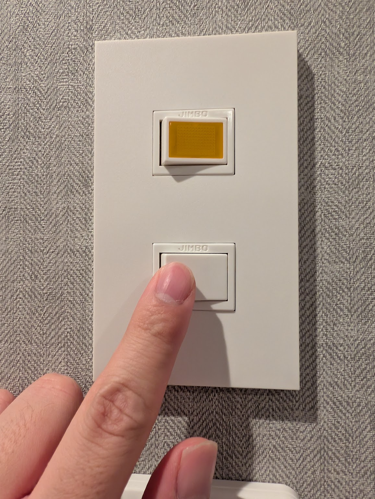

<h1 mt="28">たかがボタン、されどボタン</h1>

button要素から深ぼるボタンUIの定義について

BuriKaigi 2026 Day2 | <time datetime="2026-01-10">2026-01-10</time>

[ドキュメントページ](https://yamanoku.net/burikaigi-2026/)

  
    やまのく（yamanoku）
  

---
layout: center
---

<h1>今日 どんなボタンを 押してきましたか？</h1>

---

<v-drag pos="21,99,428,245">
  
</v-drag>

<v-drag pos="707,101,245,317">
  
</v-drag>

<v-drag pos="455,100,245,320">
  
</v-drag>

---
dragPos:
  foo: 446,44,468,277
---

<v-drag pos="foo">

今日の発表を𝕏にポストしよう！

</v-drag>

<v-click> 

## やまのく（yamanoku）

- 一児の父。会社員
- 千葉県在住
- BuriKaigi初参加
- 家族で初富山
  - すし玉行ってきました🍣

</v-click>

---
layout: center
---

# ボタンとは何か？

---
layout: center
---

<FirstButton />

---

# 様々なボタンたち

<ButtonShowCase />

---

# アフォーダンス

<!--
このモノと人との間に生まれる「押せそうに見える」という感覚をもつこと、これを**アフォーダンス**と呼びます。

アフォーダンスは、心理学者ジェームズ・ギブソンが提唱した概念で、モノの形がその使い方を誘発するというものです。たとえば椅子を見かけたら人は座るかもしれないし、それを台にするかもしれないし、なんらかの置き場にするかもしれません。人とモノの数だけアフォーダンスは生まれます。
-->

---

# シグニファイア

## ボタンが無効であるかどうか

  <DisabledButton />

## アイコンで何ができるかを表す

  <IconButton tooltip="ファイルを開く">
    <twemoji-file-folder />
  </IconButton>

  <IconButton tooltip="追加する">
    <twemoji-plus />
  </IconButton>

  <IconButton tooltip="検索">
    <twemoji-magnifying-glass-tilted-left />
  </IconButton>

  <IconButton tooltip="戻る">
    <twemoji-right-arrow-curving-left />
  </IconButton>
  
  <IconButton tooltip="進む">
    <twemoji-left-arrow-curving-right />
  </IconButton>

  <IconButton tooltip="印刷する">
    <twemoji-printer />
  </IconButton>

  <IconButton tooltip="コメントする">
    <twemoji-left-speech-bubble />
  </IconButton>

  <IconButton tooltip="保存する">
    <twemoji-floppy-disk />
  </IconButton>

<!--
ここから派生して認知科学者ドナルド・ノーマンは**シグニファイア**という概念を提唱しました。こちらはUIデザインの文脈で使われるもので、モノの使い方を誘発するための「ヒント」とされています。

単なるボタンは押せそうに見えますが、これが`disabled`、つまり非活性になっている場合あれば「押せない」というヒントが提示されていると分かります。

特定のアイコンが書かれたボタンがあればそれに対応したボタンだと分かります。ボタン自体の形を変えることで、どのような操作が可能かを示すこと�
