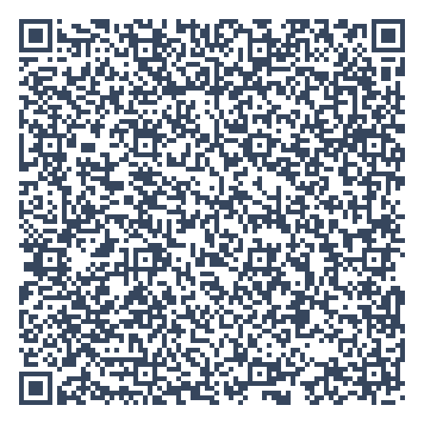
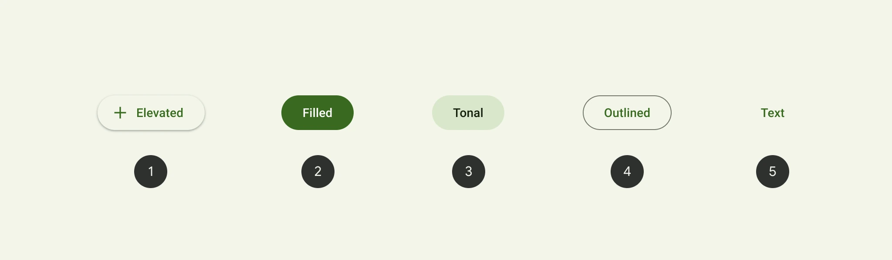

<h1 mt="32">たかがボタン、されどボタン</h1>
<div class="text-10 font-700">button要素から深ぼるボタンUIの定義について</div>

<div mt="5">
BuriKaigi 2026 Day2 | <time datetime="2026-01-10">2026-01-10</time>
</div>

<div class="absolute bottom-16">
  <span class="text-6 font-700">
    やまのく（yamanoku）
  </span>
</div>

---
layout: center
---

<h1>今日<br>どんなボタンを<br>押してきましたか？</h1>

---

# p.3


---
dragPos:
  foo: 446,44,468,277
---

<v-drag pos="foo">
<div text="6" font="bold" class="text-center">今日の発表を𝕏にポストしよう！</div>

</v-drag>

<v-click> 

## やまのく（yamanoku）

<p></p>

- 一児の父。会社員
- 千葉県在住
- BuriKaigi初参加
- 家族で初富山

</v-click>

---
layout: center
---

# ボタンとは何か？

---
layout: center
---

<FirstButton />

---

# 様々なボタンたち

<ButtonShowCase />

---

# アフォーダンス


---

# シグニファイア

## ボタンが無効であるかどうか

<div>
  <DisabledButton />
</div>

## アイコンで何ができるかを表す

<div mt="10" class="grid auto-cols-max grid-flow-col gap-4">
  <IconButton tooltip="ファイルを開く">
    <twemoji-file-folder />
  </IconButton>

  <IconButton tooltip="追加する">
    <twemoji-plus />
  </IconButton>

  <IconButton tooltip="検索">
    <twemoji-magnifying-glass-tilted-left />
  </IconButton>

  <IconButton tooltip="戻る">
    <twemoji-right-arrow-curving-left />
  </IconButton>
  
  <IconButton tooltip="進む">
    <twemoji-left-arrow-curving-right />
  </IconButton>

  <IconButton tooltip="印刷する">
    <twemoji-printer />
  </IconButton>

  <IconButton tooltip="コメントする">
    <twemoji-left-speech-bubble />
  </IconButton>

  <IconButton tooltip="保存する">
    <twemoji-floppy-disk />
  </IconButton>
</div>

---

# GUI


<div>Xerox Alto and Xerox 8010 Star</div>

---

# スキューモフィズム


iPhone登場~iOS6

---

# フラットデザイン


<p>iOS7以降</p>


---
layout: center
---

<IsThisButton />

---

# ニューモフィズム・グラスモーフィズム

<div class="grid grid-rows-2 gap-10">
  <div p="10" style="background-color: #e0e5ec;">
    <Neumorphism />
  </div>

  <div p="10" style="background: linear-gradient(135deg, #565656ff 0%, #000000 100%);">
    <GlassMorphism />
  </div>
</div>

---

# マテリアルデザイン



https://github.com/material-components/material-web/blob/main/docs/components/button.md

---
layout: center
---

# フラットデザインの影響

---
dragPos:
  foo: 149,79,413,158
---

<v-drag pos="foo">

</v-drag>

---
layout: image
image: "https://yamanoku.net/burikaigi-2026/images/link-button-figma.png"
---

---
layout: image
image: "https://yamanoku.net/burikaigi-2026/images/link-button-in-modal.png"
---

---
dragPos:
  foo: 87,100,800,305
---

<v-drag pos="foo">

</v-drag>

---
layout: center
---

# 1: type属性を忘れた`<button>`

---
layout: center
---

```html
<form>
  <label><input type="text" name="zipCode">郵便番号</label>
  <button onclick="searchAddress()">住所検索</button>
  <label><input type="text" name="prefecture" autocomplete="address-level1">都道府県</label>
  <label><input type="text" name="city" autocomplete="address-level2">市区町村</label>
  <label><input type="text" name="address" autocomplete="address-line1">番地</label>
  <button>送信する</button>
</form>
```

---
layout: center
---

# HTML Living Standard

---
layout: center
---

| type値 | 挙動 |
|--------|------|
| `submit` | フォームを送信する |
| `reset` | フォームをリセットする |
| `button` | **何もしない（スクリプト用）** |


---
layout: image
image: "https://yamanoku.net/burikaigi-2026/images/old-html-form-image.png"
---

---
layout: center
---

<div class="grid grid-columns-2 gap-20">

# HTML 2.0 <br> `<input type="submit">`

# HTML 4.0 <br> `<button>`

</div>

<v-drag-arrow pos="484,239,1,59"/>

---
layout: center
---

```html
<!-- 🔴 危険：フォーム内で意図せず送信が発生 -->
<form>
  <button onclick="searchAddress()">住所検索</button>
  <button>送信する</button>
</form>
```

```html
<!-- 🟢 用途に分けてtype指定 -->
<form>
  <button type="button" onclick="searchAddress()">住所検索</button>
  <button type="submit">送信する</button>
</form>
```

---

# Lintルールで防ぐ

- html-eslint: @html-eslint/require-button-type
- eslint-plugin-react: react/button-has-type
- eslint-plugin-vue: vue/html-button-has-type
- angular-eslint: @angular-eslint/template/button-has-type
- eslint-plugin-svelte: svelte/button-has-type
- Biome: lint/a11y/useButtonType
- Deno lint: jsx-button-has-type

---

# Markuplintで独自設定

```json
{
  "rules": {
    "required-attr": true,
  },
  "nodeRules": [
    {
      "selector": "button",
      "rules": {
        "required-attr": {
          "value": [
          {
            "name": "type",
            "value": ["button", "reset", "submit"]
          }
        ],
      }
    }
  ]
}
```

---

# `type`にまつわる余談

## ①新しい`type`属性が提案されていた・いる

- `type="share"`（未採択）
  - Web Share APIのボタン
- `type="selectlist"`（未採択）
  - `<select>`要素内でリストボックスを開くためのボタンのため
- `type="press"`（提案中）
  - 押下されている状態を表現

---

# `type`にまつわる余談

## ②`type`属性のデフォルト値を変えたい！

[Investigate making the invalid state of `<button type>` _not_ submit · Issue #10462 · whatwg/html](https://github.com/whatwg/html/issues/10462)
---
layout: center
---

# 2: `<a>`で実装されたボタンUI

---
layout: center
---

```html
<a href="#" onclick="doSomething()">処理を実行する</a>
```

```html
<a href="javascript:void(0)" onclick="openModal()">モーダルを開く</a>
```

---
layout: center
---

# 振る舞いに注目

---

# ARIA Authoring Practices Guide

## Button

> "A button is a widget that enables users to trigger an action or event, such as submitting a form, opening a dialog, canceling an action, or performing a delete operation."<br>
> （ボタンは、フォーム送信、ダイアログを開く、アクションのキャンセル、削除操作など、アクションやイベントをトリガーするウィジェットです）

## Link

> "A link widget provides an interactive reference to a resource. The target resource can be either external or local."<br>
> （リンクは、リソースへの対話的な参照を提供します。対象リソースは外部でもローカルでも構いません）

---
layout: center
---


|  | ボタン | リンク |
|------|--------------|----------------|
| 目的 | **アクション実行** | **ナビゲーション** |
| 期待される結果 | 何かを実行する | ページ遷移・特定位置に移動する |
| 例 | モーダルを開く、削除する | 別ページへ移動 |

<v-click>
<div text="6" mt="10" style="display: grid; place-content: center;">

**リンクはどこかへ移動する、ボタンは何かをする** ものと定義できる

</div>
</v-click>

---

# キーボード操作

## Button

- <kbd>Space</kbd>: Activates the button.
- <kbd>Enter</kbd>: Activates the button.

## Link

- <kbd>Enter</kbd>: Executes the link and moves focus to the link target.
- <kbd>Shift</kbd> + <kbd>F10</kbd> (Optional): Opens a context menu for the link.

---

# リンクそのものの処理を除外する処理

```javascript
const link = document.getElementById('link');
link.addEventListener('keydown', (e) => {
  if (e.key === 'Enter' || e.key === ' ') {
    e.preventDefault();
    link.click();
  }
});
link.addEventListener('keyup', (e) => {
  if (e.key === ' ') {
    e.preventDefault();
  }
});
link.addEventListener('contextmenu', (e) => {
  e.preventDefault();
});
//...
```

---
layout: center
---

# <twemoji-heavy-multiplication-x /> `<a>`

# <twemoji-hollow-red-circle /> `<button>`

---
layout: center
---

# リンク遷移させるなら<br>`<a>`を使う

---
layout: center
---

# 3: `<div>`で実装されたボタンUI

---
layout: center
---

```html
<div onclick="handleClick()">ボタン</div>
```

---
layout: center
---

<UnlessButton />

---

# 暗黙の役割

<v-click>

- `<button>` ... ボタン
- `<a>` ... リンク
- `` ... 画像
- `<table>` ... テーブル

</v-click>

<v-click>

<hr />

<br />

- `<div>` ... generic
  - 自分自身で意味を持たない名前のない役割

</v-click>

---

# HTMLの役割は支援技術に伝わる


---

# スクリーンリーダーでの違い

## button

```html
<button type="button" onclick="openDialog()">ダイアログを開く</button>
```

- 「ボタン、ダイアログを開く」

## div

```html
<div onclick="openDialog()">ダイアログを開く</div>
```

- 「ダイアログを開く」

---
layout: center
---

# Web Content Accessibility Guidelines <br> (WCAG)

---

# 4.1.2 名前 (name)・役割 (role)・値 (value)

## 達成基準

> すべてのユーザインタフェース コンポーネント (フォームを構成する要素、リンク、スクリプトが生成するコンポーネントなど) では、名前 (name) 及び役割 (role) は、プログラムによる解釈が可能である。

<v-click>

```html
<div role="button" onclick="openDialog()">ダイアログを開く</div>
```

</v-click>

<v-click>

- 役割を上書きすることで「ボタン」と読み上げられる
- しかし`<button>`本来がもつキーボード操作は付与されていない

</v-click>

---

# 2.1.1 キーボード (レベル A)

## 達成基準

> コンテンツのすべての機能は、個々のキーストロークに特定のタイミングを要することなく、キーボードインタフェースを通じて操作可能である。

<v-click>

```html
<div role="button" tabindex="0" onclick="openDialog()">ダイアログを開く</div>
```

</v-click>

<v-click>

- 他にも<kbd>Enter</kbd>や<kbd>Space</kbd>でアクションさせる挙動も必要
  - <kbd>Enter</kbd>は`keydown`で発火し、押しっぱなしだと連続で発火する
  - <kbd>Space</kbd>は`keyup`で発火するが、押しっぱなしのまま<kbd>Tab</kbd>でフォーカス移動すると発火しない

</v-click>

---

# ガイドラインから学ぶ鉄則

## Using ARIA

> If you can use a native HTML element or attribute with the semantics and behavior you require already built in, instead of re-purposing an element and adding an ARIA role, state or property to make it accessible, then do so.<br>
> （必要なセマンティクスと振る舞いを持つネイティブHTML要素が使えるなら、ARIAで無理やり作るのではなく、それを使ってください）

## ARIA Authoring Practices Guide

> No ARIA is better than Bad ARIA<br>
> （悪いARIAより、ARIAを使わない方がマシである）

---

# ざんねんなボタンUI実装

## ① type属性を忘れた`<button>`

<v-click>

- `<button>`の挙動を正しく理解し、適切なtype属性を付与する

</v-click>

## ② `<a>`で実装されたボタンUI

<v-click>

- HTML要素がもつ役割を正しく認識し、適切な場面で適切な要素を扱うようにする

</v-click>

## ③ `<div>`で実装されたボタンUI

<v-click>

- 即刻辞めましょう。何もいいことがありません。

</v-click>

---
layout: center
---

# おわりに

---
layout: image
image: 'https://yamanoku.net/burikaigi-2026/images/ai-create-button.png'
---

---
layout: image
image: 'https://yamanoku.net/burikaigi-2026/images/good-button.png'
---

---
layout: center
---

# たかがボタン、されどボタン

---
layout: end
---

# Thank You For Listening !!
